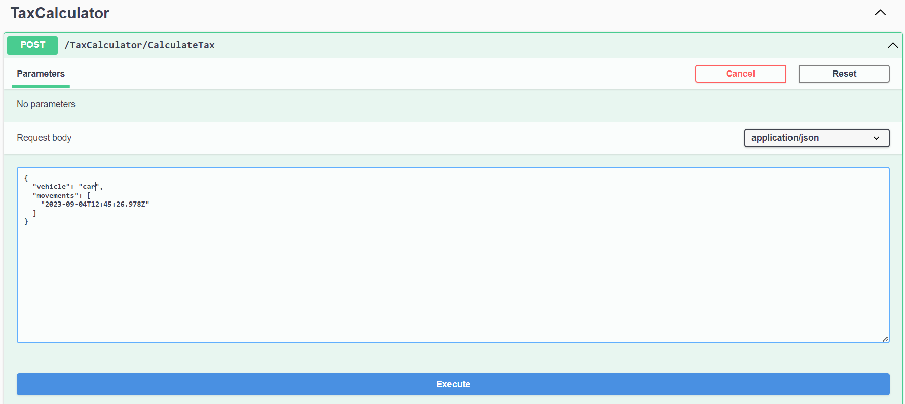

# How To Test Solution

This document helps you to run the solution and evaluate it from several aspects.

## Prerequities

1. **SQL Server:** First of all, SQL Server 2017 or above should instelled on your machine.
2. **DotNet Core 7:** DotNet Core 7 or above should instelled on your machine.
3. **Visual Studio 2022:** Visual Studio 2022 or above should installed on your machine.
4. **Create DataBase:** Open solution in Visual Studio 2022. Right click on `CongestionTaxCalculator.Infra` project and select `Open in Terminal`.
   In the opened terminal type this command and press _Enter_:

```console
dotnet ef database update
```

5. **Gothenburg Data:** You need initial data to run the solution. Open SQL Management Studio and connect to local server. Open a Query and paste `Gothenburg-sqlserver-inserdata.sql` content there. Execute the query to insert initial data to _CongestionTaxCalculatorDB_.

## Run UnitTest

If you need to run unit tests you need simply open `TestExplorer` form `Test` menu. Then select `CongestionTaxCalculator.UnitTest` and click _Run_.


## Run IntegrationTest

If you need to run integration tests it consists two steps:

1. Set `CongestionTaxCalculator.Api` as _StartUp_ project.
2. Run the solution.
3. Open another instance of Visual Studio.
4. In new opened Visual Studio, open `TestExplorer` (as mentioned before), select `CongestionTaxCalculator.IntegrationTest` and from run menu select _Debug_


## Run EndPointApi

`CongestionTaxCalculator.EndPointApi` project is for test CongestionTaxCalculator. To run this project you should follow these steps:

1. Set `CongestionTaxCalculator.EndPointApi` as _StartUp_ project.
2. Run the solution.
3. Use SwaggerUI to execute _CalculateTax_ method.


